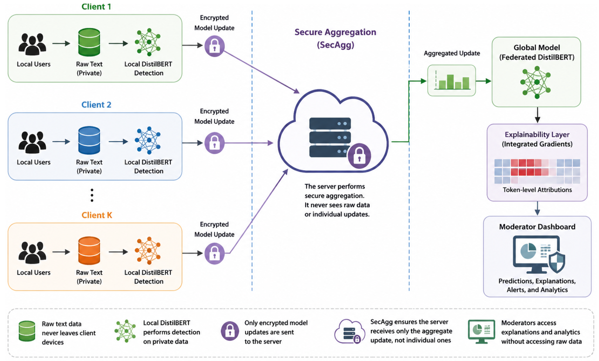

# FEPP-CD — Federated, Explainable, Privacy-Preserving Cyberbullying Detection

Code, released predictions and analysis scripts for the paper

> **A Federated, Secure, and Explainable Transformer Framework for Privacy-Preserving Cyberbullying Detection under Non-IID Social Media Data**
> Muhammad Israr Ul Haq, Muhammad Muneer Umar, Amjad Mehmood, Jaime Lloret.
> Submitted to *Applied Soft Computing*.

FEPP-CD fine-tunes DistilBERT across simulated social-media clients with **Federated Averaging**, studies **Dirichlet non-IID** client skew, hides individual updates with **pairwise-masking Secure Aggregation (SecAgg)**, probes robustness with **label-flipping poisoning**, and explains predictions with **Integrated Gradients (IG)**, validated against **HateXplain** human rationales and target communities.



---

## What is in this repository

| Part | Purpose | Needs GPU / datasets? |
|---|---|---|
| `results/` | Per-example predictions (`y_true`, `y_pred`, `y_prob`) for every experiment in the paper, training logs, XAI outputs, original plots | — |
| `scripts/evaluate.py`, `scripts/make_figures.py`, `scripts/verify_paper.py` | Recompute **every table, number and figure** of the paper from `results/` and check them against the manuscript | No (CPU, ~4 min) |
| `src/fepp_cd/` | Library: data loading, IID/Dirichlet partitioning, DistilBERT classifier, FedAvg, SecAgg, label flipping, IG, metrics | — |
| `scripts/train.py`, `configs/*.yaml` | Re-run the federated experiments | Yes |
| `scripts/explain.py` | IG global token importance and HateXplain rationale alignment (see docs/METHOD.md for the rationale-selection rule) | Yes (trained model) |
| `tests/` | Unit tests (SecAgg cancellation, partitioning, metrics, released numbers) and an offline end-to-end smoke test | No |

```
FEPP-CD/
├── configs/                 experiment configs (one per paper condition + smoke test)
├── data/raw/                place the raw datasets here (not redistributed, see docs/DATA.md)
├── docs/                    DATA.md, REPRODUCIBILITY.md, METHOD.md, framework figure
├── results/
│   ├── predictions/         kaggle/{iid,noniid,flip_010,flip_020,flip_030}.csv, jigsaw/{iid,noniid}.csv, hatexplain/predictions.csv
│   ├── logs/                client partitions, Jigsaw round log
│   ├── xai/                 rationale alignment, global IG token importance
│   ├── reports/             original classification reports / metric summaries
│   ├── original_plots/      plots produced by the original notebook runs
│   ├── tables/  figures/    regenerated by scripts/evaluate.py and scripts/make_figures.py
│   ├── paper_numbers.json   every recomputed value (generated)
│   ├── RESULTS.md           all regenerated tables in Markdown (generated)
│   └── MANIFEST.md          provenance + SHA-256 of every released file
├── scripts/                 train, explain, evaluate, make_figures, verify_paper, run_all_experiments.sh, reproduce_paper.sh
├── src/fepp_cd/             metrics, partition, attacks, secagg, comm, data, model, federated, explain
└── tests/
```

## Quick start: reproduce the paper's numbers (no GPU)

```bash
git clone https://github.com/IsrarU/FEPP-CD.git
cd FEPP-CD
pip install -r requirements-eval.txt
bash scripts/reproduce_paper.sh      # evaluate.py + make_figures.py + verify_paper.py
```

`verify_paper.py` compares 118 values printed in the manuscript (metrics, confusion counts, bootstrap intervals, calibrated operating points, ECE, McNemar test, label-flipping deltas, community and rationale statistics) with the values recomputed from `results/` and reports `118/118 printed values reproduced`.

## Main results (recomputed from `results/predictions`)

| Dataset | Condition | n | Accuracy | Macro F1 | ROC-AUC | AUPRC | TMR | FAR |
|---|---|---:|---:|---:|---:|---:|---:|---:|
| Kaggle CB | IID FL | 8,787 | 0.9286 | 0.8500 | 0.9605 | 0.9928 | 3.62% | 28.25% |
| Kaggle CB | IID FL + SecAgg | 8,787 | 0.9286 | 0.8500 | 0.9605 | 0.9928 | 3.62% | 28.25% |
| Kaggle CB | Non-IID FL (α = 0.5) | 8,787 | 0.9245 | 0.8233 | 0.9592 | 0.9925 | 1.94% | 41.26% |
| Kaggle CB | Label flip 30% | 8,787 | 0.9205 | 0.8416 | 0.9505 | 0.9908 | 5.18% | 24.66% |
| Jigsaw | IID FL | 31,882 | 0.9625 | 0.9010 | 0.9799 | 0.9107 | 14.25% | 2.56% |
| Jigsaw | Non-IID FL (α = 0.5) | 31,882 | 0.9606 | 0.8732 | 0.9706 | 0.8925 | 35.87% | 0.33% |
| HateXplain | IID FL (external) | 4,029 | 0.7607 | 0.7497 | 0.8283 | 0.8583 | 18.47% | 31.96% |

TMR = toxic miss rate = FN/(TP+FN); FAR = false alarm rate = FP/(TN+FP). The SecAgg row equals FedAvg by construction (Proposition 1 in the paper); see *Secure Aggregation* below.

Further findings reproduced by `scripts/evaluate.py`:

* **Threshold calibration.** At a matched TMR ≤ 2 %, IID and non-IID FAR are 39.82 % vs 40.78 %; at TMR ≤ 5 %, 22.11 % vs 23.62 %. The non-IID safety shift is mostly an operating-point effect.
* **McNemar (IID vs non-IID, Kaggle).** b = 242, c = 206, χ² = 2.734, p = 0.098.
* **Label flipping (30 %).** Accuracy −0.82 pp, TMR +42.9 % (relative), ROC-AUC 0.9605 → 0.9505.
* **HateXplain.** IG–human rationale alignment F1 = 0.5683 (100 posts); Macro F1 ranges 0.5485–0.7316 across 12 target communities.
* **Calibration (ECE, 10 bins).** Kaggle IID 0.069, Jigsaw non-IID 0.038, HateXplain 0.219.

All tables are in [`results/RESULTS.md`](results/RESULTS.md) after running the evaluation.

## Re-running the experiments

```bash
pip install -r requirements.txt
# place the raw datasets as described in docs/DATA.md, then e.g.
python scripts/train.py --config configs/kaggle_iid.yaml --save_model
python scripts/train.py --config configs/kaggle_noniid.yaml
python scripts/train.py --config configs/kaggle_iid_secagg.yaml
python scripts/train.py --config configs/kaggle_flip_030.yaml
bash scripts/run_all_experiments.sh     # everything
```

Each run writes `predictions.csv`, `round_log.csv`, `client_distribution.csv`, `metrics.json`, `classification_report.csv` and `communication.json` to `runs/<name>/`.

No GPU or internet? `python scripts/train.py --config configs/smoke.yaml` trains a tiny random DistilBERT on a synthetic corpus with Dirichlet partitioning, SecAgg and label flipping in a few seconds.

Default hyperparameters (paper Table 5): `distilbert-base-uncased`, max length 128, dropout 0.30, AdamW, learning rate 2e-5, batch size 32, 3 local epochs, K = 5 clients, α = 0.5, gradient clipping 1.0, seed 42, class-weighted BCE with ω⁺ = n_neg / n_pos, 10 rounds (Kaggle, HateXplain) and 5 rounds (Jigsaw), IG with 50 steps.

## Important notes on provenance

* **Released predictions.** The files in `results/predictions/` are the outputs of the original Kaggle notebook runs (`israrul/mscs-experment`) used for the paper; `results/MANIFEST.md` maps each one to its original file and gives its SHA-256 checksum. All numbers in the paper are recomputed from these files.
* **Training code.** `src/fepp_cd/` is a clean, modular implementation of the pipeline described in the paper with the same hyperparameters. Re-training will give results close to, but not bit-identical with, the released predictions: GPU kernels are non-deterministic, and text cleaning, split order and data-loader order can differ between implementations. Report re-runs as re-runs.
* **HateXplain text.** `results/predictions/hatexplain/predictions.csv` keeps `post_id`, labels, targets and rationale positions but not the post text; join with the public `dataset.json` on `post_id` to recover it.
* **Supplementary centralized run.** `results/predictions/kaggle/centralized_supplementary.csv` contains predictions of a centralized DistilBERT on the same frozen Kaggle test set (accuracy 0.9285, Macro F1 0.8592, ROC-AUC 0.9665). It is not reported in the current manuscript; `scripts/evaluate.py` writes its metrics to `results/tables/supplementary_centralized_baseline.csv`.
* **Model checkpoints** (~265 MB each) are not stored in git (GitHub limit 100 MB); see `results/MANIFEST.md`.

## Secure Aggregation

`src/fepp_cd/secagg.py` implements the honest-but-curious pairwise-masking protocol of Bonawitz et al. (2017): pairwise Diffie–Hellman key agreement (RFC 3526 2048-bit group) → SHA-256 seed → PCG64 mask stream per round and parameter tensor. Client updates, pre-weighted by n_k/n, are encoded in fixed point (24 fractional bits) in Z₂³², so the masks cancel **exactly** in the server's sum; the only difference from float FedAvg is quantization (≤ K·2⁻²⁵ per coordinate; `tests/test_training_smoke.py` checks < 1e-6). Client dropout recovery, malicious-server verification and differential privacy are out of scope, as stated in the paper's threat model.

The communication figures in the paper (13.2 GB vs 16.5 GB) are an **analytical** accounting: T·K·d·4 bytes with d ≈ 66 M and an assumed masking/key-agreement overhead ρ = 0.25 (`src/fepp_cd/comm.py`). `runs/*/communication.json` additionally reports the actual payload of this implementation.

## Tests

```bash
pip install -r requirements.txt pytest
pytest -q            # 24 tests; torch-dependent tests are skipped if torch is not installed
```

## Datasets

The raw datasets are public but are not redistributed here; see [`docs/DATA.md`](docs/DATA.md) for download links, expected paths and the binary label mapping. Please respect each dataset's terms of use.

## Citation

```bibtex
@article{ulhaq2026feppcd,
  title   = {A Federated, Secure, and Explainable Transformer Framework for Privacy-Preserving
             Cyberbullying Detection under Non-IID Social Media Data},
  author  = {Ul Haq, Muhammad Israr and Umar, Muhammad Muneer and Mehmood, Amjad and Lloret, Jaime},
  journal = {Applied Soft Computing},
  note    = {Under review},
  year    = {2026}
}
```

## License

MIT — see [`LICENSE`](LICENSE). Dataset licenses are those of the original providers.

## Ethics

The framework is intended to assist human moderators, not to replace human review. The datasets contain offensive language; no attempt is made to identify individual users.
